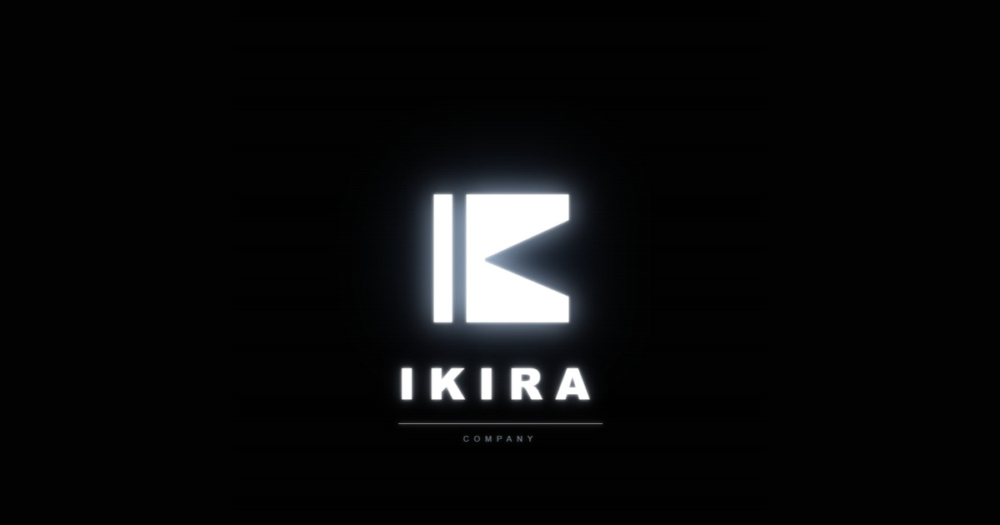

<p align="center">
    
</p>

<p align="center">
    <a href="./README.md">🇬🇧 English</a> &nbsp;|&nbsp; 🇷🇺 Русский
</p>

<h1 align="center">IKIRA</h1>

<p align="center">
Создаём современное программное обеспечение с акцентом на производительность, масштабируемость и чистую архитектуру.
</p>

<p align="center">
    <a href="https://ikira.space">Сайт</a>
    •
    <a href="https://github.com/Ikira-Company">GitHub</a>
    •
    <a href="https://t.me/ikira_company">Telegram</a>
</p>

---

## О нас

Ikira — независимая компания по разработке программного обеспечения, специализирующаяся на создании надёжных, масштабируемых и высокопроизводительных цифровых продуктов.

Мы работаем со стартапами, бизнесами и организациями, создавая современное ПО, рассчитанное на долгую жизнь. Каждый проект строится с вниманием к архитектуре, производительности и долгосрочной поддерживаемости.

От веб-платформ до мобильных приложений и низкоуровневого ПО — наша цель всегда одна: создавать продукты, которые решают реальные задачи.

| Основана | Команда | Проектов сделано |
|:---:|:---:|:---:|
| 2025 | 10 | 7 |

---

## Услуги

- Веб-разработка
- Мобильные приложения
- UI / UX Дизайн
- Архитектура ПО
- Технический консалтинг
- Низкоуровневая разработка
- Десктопные приложения
- Кастомные программные решения

---

## Технологии

### Frontend
- React
- Next.js
- TypeScript
- JavaScript
- HTML5
- CSS3
- Tailwind CSS
- Three.js

### Backend
- Node.js
- Laravel
- PHP
- Python
- Java
- Rust
- C
- C++

### Mobile
- Kotlin
- Kotlin Native
- React Native

### Базы данных
- PostgreSQL
- MySQL
- MongoDB
- Redis
- Supabase
- Firebase

### DevOps и инфраструктура
- AWS
- Docker
- Linux
- ARM64
- Git
- Shell
- Bash
- Firewall

### Дизайн
- Figma
- Blender

---

## Избранные проекты

### Power Control
Современная десктопная утилита, переосмысляющая классическое окно завершения работы Windows — с поддержкой тем, плавными анимациями и продуманным UX.

**Стек**
```
HTML
JavaScript
Node.js
Python
Shell
```

---

### CodureLMS
Внутренняя обучающая платформа для стажёров и новых сотрудников IT-команды.

**Стек**
```
Laravel
Alpine.js
Tailwind CSS
MySQL
Docker
```

---

### CodureTech Development
Официальный сайт CodureTech — креативной IT-команды, создающей кастомные цифровые решения.

**Стек**
```
Next.js
Docker
```

---

### EduLMS
Современная LMS-платформа с интерактивными курсами и передовыми технологиями.

**Стек**
```
Laravel
Docker
```

---

### Primăria Pociumbăuți
Официальный сайт муниципалитета города Pociumbăuți, Республика Молдова.

**Стек**
```
React
Node.js
```

---

### EcoVata Termica
Сайт компании, специализирующейся на экологичном утеплении домов целлюлозной ватой.

**Стек**
```
Next.js
```

---

### TA Motor Group
Сайт автосервиса премиум-класса с акцентом на качество и профессионализм.

**Стек**
```
Next.js
```

---

Больше проектов и деталей — в [портфолио на нашем сайте](https://ikira.space/#works).

---

## Наша философия

Мы считаем, что хорошее программное обеспечение должно быть:

- Быстрым
- Надёжным
- Поддерживаемым
- Безопасным
- Масштабируемым

Технологии меняются.
Чистая архитектура — нет.

---

## Open Source

Мы активно поддерживаем и развиваем наши open-source проекты.

Наши репозитории включают внутренние инструменты, десктопные приложения, утилиты и экспериментальные технологии.

Вы можете изучать их, вносить свой вклад или просто учиться на их примере.

---

## Контакты

**Сайт**
https://ikira.space

**Email**
IkiraCompany@gmail.com

**Telegram**
https://t.me/ikira_company

---

<p align="center">
    <strong>Создаём программное обеспечение, которое живёт долго.</strong>
</p>

<p align="center">
    Сделано с ❤️ командой <strong>Ikira</strong>
</p>